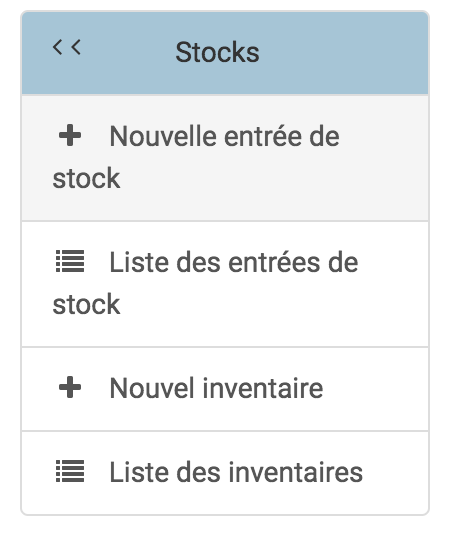
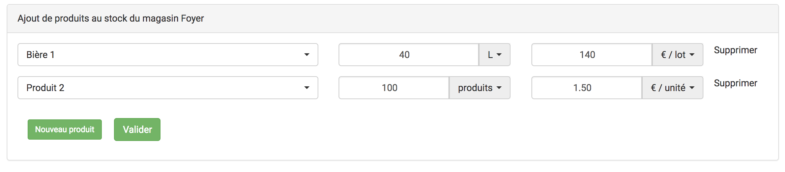
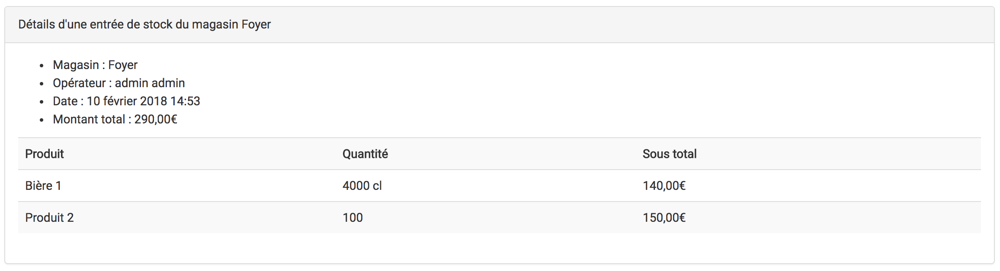
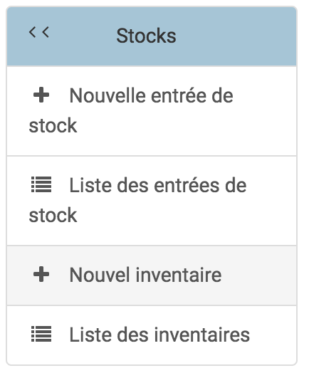
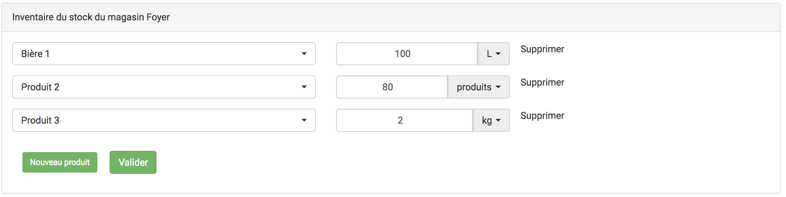
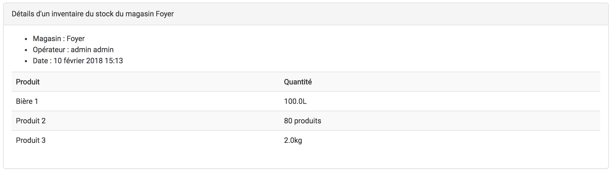

   

# Documentation - Gestion des stocks

## Application

Build : [4.5.0 + ](https://github.com/borgia-app/Borgia/releases/tag/4.5.0)

Licence : [GNU GPL version 3](https://github.com/borgia-app/Borgia/blob/master/license.txt)

## Introduction

Borgia dispose d'une application de gestion des stocks. Elle a pour objectif d'aider les utilisateurs et notamment les dirigeants des différents magasins dans leur gestion des stocks.

Une gestion efficace des stocks permet à Borgia d'être en phase avec l'état réel des stocks. Lors des ventes sur l'application, l'ajustement sera tel que le stock estimé sera au plus proche (dans l'idéal égale) au stock réel et permettra aux dirigeants d'obtenir cette information rapidement sans inventaire. De plus le prix de vente sera optimisé et garanti.

Ce tutoriel a pour objectif d'expliquer et de guider l'utilisateur dans les différentes tâches qu'il sera amener à faire vis à vis des stocks dans Borgia.

## Produits & ventes

Les utilisateurs de Borgia peuvent acheter des produits via l'application. Ceux-ci sont ajoutés et gérés dans chacun des magasins ou via les interfaces des personnes compétentes (présidents et trésoriers notamment).

Lors d'une vente, un ou plusieurs produit est "vendu" à un utilisateur à un prix fixe. Cette partie de Borgia, qui gère les ventes, est à dissocier du bon fonctionnement des stocks. En effet, même si la gestion des stocks n'est pas effectué correctement (c'est à dire que Borgia n'affiche pas des informations cohérentes vis à vis du stock réel en magasin), la vente est toujours possible.
Par exemple, un produit affiché comme n'étant plus en stock est toujours vendable.

Une exception à cette séparation de principe: la gestion du prix en mode automatique. Voir la section "Prix de vente" pour plus d'informations à ce sujet.

## Entrées, sorties de stocks & inventaires

Afin d'utiliser au mieux l'application de gestion des stocks, les dirigeants des différents magasins de Borgia doivent fournir deux types d'informations à Borgia: les entrées, les sorties de stocks et les inventaires.

### Entrées et sorties de stocks

#### Principe

Les responsables du magasin doivent informer Borgia à chaque achat de produits: le prix d'achat, la date et la quantité.

Les sorties de stocks sont la plupart du temps automatiques: c'est le cas d'une vente par exemple. Mais elles peuvent aussi être non automatiques et doivent dans ce cas être explicitement fournies à Borgia. Par exemple, un produit est vendu en dehors du système de vente de Borgia ou encore lorsqu'un produit périmé est mis au rebus.

#### Guide

Pour ajouter un ou des produits au stock, il suffit de cliquer sur l'onglet `Stocks` puis `Nouvelle entrée de stocks` dans le menu latéral d'un magasin.

Chaque produit du magasin peut être ajouté, en indiquant sa quantité et son prix. La quantité peut être indiquée avec plusieurs unités (si le produit le permet) et le prix à l'unité ou au lot. Attention de bien regarder les unités avant de valider.

Pour ajouter un ligne de produit il suffit de cliquer sur `Nouveau produit`.

Une fois validée, l'entrée de stock est créée et ajoutée à la liste. Le détail de cette entrée est ensuite visible en cliquant sur `détails`. Les stocks des produits correspondants ont été mis à jour automatiquement.

### Inventaires des stocks

#### Principe

En plus des entrées et des sorties de stocks, chaque magasin doit régulièrement effectuer des inventaires afin de lister chaque produit et sa quantité en stock à un instant donné.

#### Guide

Pour faire un inventaire d'un magasin, il suffit de cliquer sur l'onglet `Stocks` puis `Nouvel inventaire` dans le menu latéral d'un magasin.

Chaque produit du magasin peut être ajouté, en indiquant sa quantité réelle en stock. La quantité peut être indiquée avec plusieurs unités (si le produit le permet). Attention de bien regarder les unités avant de valider. Vous ne devez indiquer que les produits qui sont réellement dans le stock, donc inutile d'ajouter des produits avec une quantité nulle (Borgia le fera implicitement).

Pour ajouter un ligne de produit il suffit de cliquer sur `Nouveau produit`.

Une fois validée, l'inventaire est créé et ajouté à la liste. Le détail de cet inventaire est ensuite visible en cliquant sur `détails`. Les stocks des produits correspondants ont été mis à jour automatiquement.

#### Préconisations

Les inventaires sont nécessaires pour utiliser au mieux Borgia, son application de gestion des stocks et d'avoir une vision cohérente et globale des magasins. Ainsi, l'équipe de développement de Borgia recommande d'effectuer régulièrement des inventaires pour chacun des magasins.

Par exemple, le foyer des élèves est un magasin où la rotation des produits est rapide et la gestion des stocks importante. Ainsi un inventaire toutes les deux semaines semble efficace et est recommandé.
Un autre magasin qui effectue moins de vente, comme les produits estampiés "Gadz" par exemple, peuvent effectuer un inventaire tous les mois en gardant une gestion des stocks cohérente.

## Prix de vente

Lorsque le prix de vente est en mode "automatique", Borgia détermine seul le meilleur prix en fonction des coûts d'achat. Il assurera alors qu'aucun produit n'est vendu à perte, et que tous les produits sont vendus au même prix. Actuellement, Borgia utilise le dernier coût d'achat pour calculer le prix de vente. L'exemple suivant détail cette méthode.

Afin de simplifier l'exemple, considérons que l'ensemble des achats sont effectués à midi et les ventes le soir. Ainsi les ventes d'un jour sont toujours faites après l'approvisionnement du jour. De plus, les colonnes stock et prix de vente sont calculés après l'opération en question.

| Date            | Type   | Produit | Quantité | Coût            | En stock (réel) | Prix de vente |
| --------------- | ------ | ------- | -------- | --------------- | --------------- | ------------- |
| -               | -      | Bière   | -        | -               | 0               | -             |
| -               | -      | Chips   | -        | -               | 0               | -             |
| 01/01/2018 midi | Entrée | Bière   | 100      | 1€/bouteille    | 100             | A=1.05€       |
| 01/01/2018 midi | Entrée | Chips   | 20       | 0.20€/packet    | 20              | B=0.19€       |
| 01/01/2018 soir | Vente  | Bière   | 10       | -               | 90              | C=1.05€       |
| 01/01/2018 soir | Vente  | Chips   | 2        | -               | 18              | D=0.19€       |
| 02/01/2018 midi | Entrée | Chips   | 50       | 0.18€/packet    | 68              | E=0.19€       |
| 03/01/2018 midi | Entrée | Bière   | 300      | 0.89€/bouteille | 390             | F=0.93€       |
| 03/01/2018 soir | Vente  | Bière   | 30       | -               | 360             | G=0.93€       |

Le prix de vente tient compte de la quantité en stock, et des entrées et sorties de stocks.
Par exemple, le 01/01/2018 à midi 100 bouteilles de bière sont ajoutées au stock, et ont été acheté au coût de 1€ par bouteille.
Dès cette entrée de stock, Borgia calcule le prix de vente de ce produit:

`A = [(coût total) / (quantité entrée)] \* (1 + marge) = [(100 * 1) / 100] \* (1 + 0.05) = 1 \* (1 + 0.05) = 1.05€``

La marge est un paramètre d'entrée de Borgia, que les administrateurs peuvent modifier. Elle se situe habituellement autour de 5% et permet de contrebalancer la perte des produits ou le vol le cas échéant. Les associations étudiantes étant souvent à but non lucratif, cette marge n'a pas vocation a financer autre chose que ces pertes éventuelles.

Lorsque plusieurs produits sont vendus, et que des entrées de stock sont effectuées à des coûts différents la formule suivante est appliquée:

`G = [(coût dernière entrée de stock) / (quantité entrée)] \* (1 + marge) = [(300 \* 0.89) / 300] \* (1 + 0.05) = 0.93€`

## Facteur de correction des ventes (FCV)

### Principe du FCV

En plus de la détermination automatique du prix de vente, Borgia effectue un traitement afin d'estimer la quantité de produit en stock. L'objectif étant d'avoir une quantité estimée la plus proche possible du réel.

Pour ce faire, chaque produit dispose d'un attribut nommé "facteur de correction des ventes (FCV)" qui permet d'ajuster la quantité vendue à la quantité sortie du stock.

Par exemple, un facteur FCV égal à 1 indique que pour 1 produit X vendu par Borgia, il y a effectivement 1 produit X qui est sorti du stock réel. C'est par exemple le cas pour les produits rares, ou ceux qui ont beaucoup de valeur.

Cependant, dans le cas des produits liquides par exemple, une vente de 25 cl ne correspond quasiment jamais à une sortie de stock de 25 cl. Mais plutôt à une sortie de (25 cl \* FCV).

Pour calculer ce facteur FCV, Borgia doit connaître les entrées, les sorties et l'état réel des stocks à certains instants (par des inventaires).

### Exemple

| Date            | Type       | Produit | Quantité | En stock (estimé) | En stock (réel) | Facteur FCV |
| --------------- | ---------- | ------- | -------- | ----------------- | --------------- | ----------- |
| -               | -          | Bière   | -        | 0                 | 0               | 1           |
| -               | -          | Chips   | -        | 0                 | 0               | 1           |
| 01/01/2018 midi | Entrée     | Bière   | 100      | 100               | 100             | 1           |
| 01/01/2018 midi | Entrée     | Chips   | 4000     | 4000              | 4000            | 1           |
| 01/01/2018 soir | Vente      | Bière   | 10       | A = 90            | ?               | 1           |
| 01/01/2018 soir | Vente      | Chips   | 200      | B = 3800          | ?               | 1           |
| 02/01/2018 midi | Inventaire | Chips   | -        | 3785              | 3785            | C = 1.075   |
| 03/01/2018 midi | Inventaire | Bière   | -        | 87                | 87              | D = 1.300   |
| 03/01/2018 soir | Vente      | Bière   | 6        | E = 79            | ?               | 1.300       |
| 03/01/2018 soir | Vente      | Chips   | 300      | F = 3462          | ?               | 1.075       |

Lorsque les produits "bière" et "chips" sont créés, le facteur FCV est initialisé à 1.000. Ainsi, après avoir ajouté des produits (jour 01/01/2018 midi), lors des ventes du soir, Borgia estime le stock en cours:

`A = stock initial estimé - vente \* FCV = 100 - 10 \* 1.000 = 90`

`B = 4000 - 200 \* 1.000 = 3800`

A la fin du jour 01/01/2018, Borgia n'a pas l'information du stock réel, et les gestionnaires du magasin non plus. Pour l'avoir, il faut réaliser un inventaire jour 02/01/2018. Les gestionnaires se rendent alors compte qu'il y a en fait 87 produits "bière" et 3785 "chips" au lieu de respectivement 90 et 3800. Borgia ajuste donc le FCV de ces produits avec la formule suivante:

`nouveau FCV = (a + b - c) / d`

Où:

* a: quantité en stock lors du dernier inventaire (0 s'il n'y a pas encore eu d'inventaire)
* b: entrées au stock depuis le dernier inventaire (depuis la création s'il n'y a pas d'inventaire)
* c: stock réel actuel donné par le courant inventaire
* d: ventes enregistrées depuis le dernier inventaire (depuis la création s'il n'y a pas d'inventaire)

`C = (0 + 4000 - 3785) / 200 = 215 / 200 = 1.075`

`D = (0 + 100 - 87) / 10 = 13 / 10 = 1.300`

### Conclusion

Ainsi, lors des prochains achats, les stocks estimés (E et F) seront au plus proche du réel. Afin d'ajuster encore plus les FCV, il faut effectuer des nouveaux inventaires et ainsi de suite.

### Remarques

* S'il n'y a pas de ventes enregistrées depuis le dernier inventaire, Borgia ne calculera pas de nouveau FCV.
* Si le stock estimé devient négatif par calcul, Borgia indiquera un stock estimé égal à 0 afin de rester cohérent. C'est souvent qu'il faut effectuer un nouvel inventaire.
* L'ensemble des calculs qui permettent d'obtenir ces formules sont disponibles et détaillés dans les commentaires du code. Notamment dans les fonctions méthodes du modèle `Product` disponible dans le fichier `/shops/models`.
